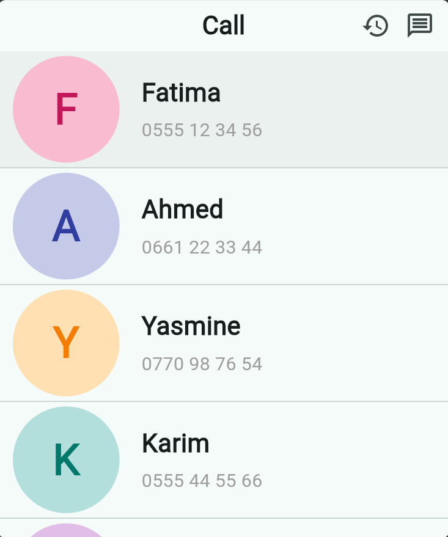
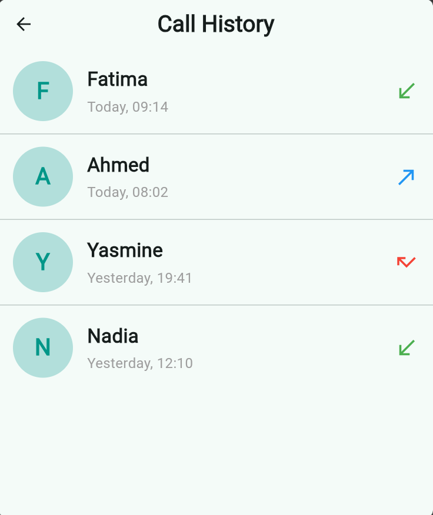
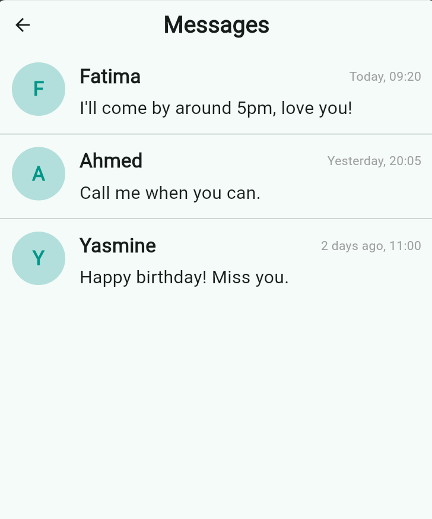

# Grandma Dialer

A one-tap, picture-based phone app for someone who can't read or write.

No text to read, no menus to navigate, no way to accidentally type
something. Just a photo, a name, and a number — tap the photo and it
calls. Built for use with a kiosk / "kid mode" launcher so it's the
only thing on the phone.

## Download
 
Just want the app, not the source code? Grab the ready-to-install APK
from the [Releases page](https://github.com/AmaniTrb/senior-dialer/releases) —
no need to build anything yourself.

## Features

- **Contacts, automatically** — pulls directly from the phone's normal
  contact list (with photos), so there's nothing to maintain separately.
- **Tap a photo to call** — places the call directly, no dialer screen.
- **Big everything** — large photos and text, about 4-5 contacts per
  screen, sized to fit any screen and both orientations.
- **Call history** — a simple, tappable list of recent calls.
- **Messages, view-only** — read received texts; there is no text
  field, reply button, or compose screen anywhere in the app, so
  there's nothing to accidentally type into.

## Screenshots





## Getting started

*(This section is for building from source — if you just want the app
installed, use the [Releases page](https://github.com/AmaniTrb/senior-dialer/releases) instead.)*

### 1. Clone and try it out

Everything needed is already committed — permissions, Gradle config,
the works.

```bash
git clone https://github.com/YOUR_USERNAME/grandma-dialer.git
cd grandma_dialer
flutter pub get
flutter run
```

`flutter run` is for testing — it needs your computer connected to
the phone (or an emulator) the whole time.

### 2. Build the real thing to install

Once you're happy with it, build a standalone APK that runs on the
phone permanently, with no computer attached:

```bash
flutter build apk --release
```

This creates the file at `build/app/outputs/flutter-apk/app-release.apk`
— copy that onto the phone (e.g. via USB, or send it to yourself) and
install it there. This is what you'd actually leave on someone's phone
for daily use.

The app will ask for Contacts, Phone, and SMS permissions the first
time each relevant screen is opened — someone with reading difficulty
will need help tapping "Allow" once.

### 3. Custom app icon

You can change the app icon by replacing the image at
`assets/icon/icon.png` (1024×1024 PNG works best), then running:

```bash
dart run flutter_launcher_icons
```

### 4. Lock it down

Use a kiosk-mode / single-app launcher (e.g. a "kid mode" feature, or
apps like Fully Kiosk) to pin this as the only app the phone can open.

## Notes for contributors

- Only Android is supported — direct calling and call-log/SMS reading
  are Android-only APIs; iOS does not permit either.
- Contact matching in the Call History and Messages screens compares
  the last 9 digits of a phone number, so formatting differences (like
  a leading `+213` or `0`) still match correctly. See `contact_utils.dart`.
- Tile sizing is calculated at runtime from the actual screen height,
  and text scales with it too, so it adapts to different screen sizes
  and to portrait/landscape without overflowing.
- Permissions live in `android/app/src/main/AndroidManifest.xml`, and
  the core library desugaring setup (required by `call_log`) is in
  `android/app/build.gradle.kts` — check there if something needs
  updating for a newer package version.

## License

MIT — see [LICENSE](LICENSE).